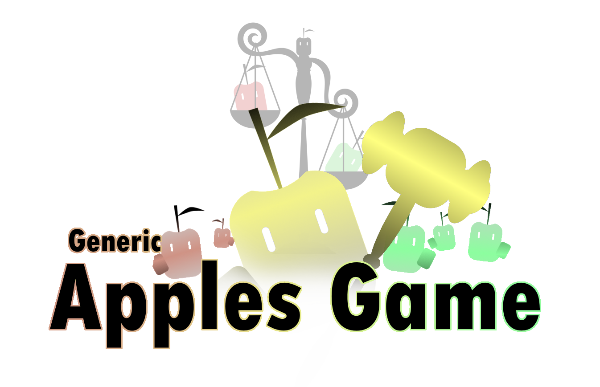

# What is "Generic Apples Game"?
**Generic Apples Game** is an online social card game simulator application that allows you and your friends to play social card games anywhere, anytime. With its minimalist design and quick response time, this app accommodates all your different web browsing enabled devices wherever you go.
## How does Generic Apples Game play?
See our [brochure](Generic_Apples_Game_Booklet.pdf) for more information!
## Commonly Asked Questions
### How do I enter join or rejoin the game?
From the title screen, insert the lobby code your host gave you into the box next to the **Join Game** button. Then, if you’re joining as a new player, in the **Join as new player** section, enter your user name and click submit. If you’re rejoining as an existing player, in the **Rejoin**, enter the player number of that user (located in the top right) and click submit.
### How do I leave the game?
Once in the game, click the **Leave Game** button in the bottom right corner.
### What social card games work best for **Generic Apples Game**?
Social card games that employ a round structure of submitting cards, one person judging the cards, and incrementing their score afterwards, like *Cards Against Humanity* and *Apples to Apples*, work best for this simulator. Other social card games, like *UNO* or *Exploding Kittens*, do not follow the template of this simulator, making them incompatible.
# How can I contribute to *Generic Apples Game*?
Thanks for your interest in expanding upon this project! To start developing, look at the [Development markdown file](DEVELOPMENT.md) for more details on setting up your desktop environment for our project! Also, look at the [Tasks and Bugs markdown file](TASKS_AND_BUGS.md) to find any commonly-reported bugs or unimplemented features to work on. If you're looking for more features to work on that aren't in the [Tasks and Bugs markdown file](TASKS_AND_BUGS.md), we recommend looking at the [issues in our GitHub Repository](https://github.com/UMM-CSci-3601-S25/it-3-potatochips/issues). 
# Features
- Fast, minimalist Design
- A variety of options to tweak your game's rules
- Real-time submissions
- Automatically reassigns judge if the judge leaves
- Unlimited lobby sizes
# How can I play *Generic Apples Game*?
Unfortunately, we currently do not have a running link deployed for *Generic Apples Game*. However, as this code is open source, feel free to reference the [Development markdown file](DEVELOPMENT.md) for more details on getting the game running on your machine.
## I want to run this game on my own URL; how would I go about that?
If you want to get this code working on Digital Ocean (a website-hosting platform), refer to the [Deployment markdown file](DEPLOYMENT.md) for more details. However, as we cannot get our deployment working at the moment, there's a good chance that these instructions may not work.
### I don't want to use Digital Ocean. What else should I do? 
If you don't want to use Digital Ocean, I recommend hosting your website on a full-stack development platform like [Firebase Studio](https://firebase.google.com/), as platforms like Firebase Studio allow for full-stack development, handling the server-side calls with MongoDB and handling the client-side display with ease.
### Can I use GitHub Pages to host this game?
You can. However, as GitHub Pages cannot handle server-side functionality itself, you need to reroute **ALL** of its calls to a proprietary server. Therefore, while you *CAN* use GitHub Pages, I highly stress using a full-stack capable development platform like [Firebase Studio](https://firebase.google.com/) as an alternative to Digital Ocean.
# Who contributed to *Generic Apples Game*?
You can see all of our contributors in the Insights section of our GitHub [here](https://github.com/UMM-CSci-3601-S25/it-3-potatochips/pulse).
# What tools did you use for this project?
We used quite a bit of tools, actually. Below, we'll list a few and their purposes:
## Building Code
- [Gradle](https://gradle.org/)
  - Used for deploying our code locally and remotely
## Development Environment
- [Visual Studio Code](https://code.visualstudio.com/)
- - Used as our main IDE (integrated development environment)
- [GitKraken](https://www.gitkraken.com/)
- - Used for committing, merging, pushing, and pulling our changes to GitHub
- [JSLint](https://www.jslint.com/)
- - Used for ensuring the organization of our code
## Programming Languages
- [Angular v19](https://angular.dev/)
  - Used for facilitating server and client interaction; uses TypeScript as its framework
- [HTML](https://html.spec.whatwg.org/)
  - Used for developing the appearance of our application
- [Java](https://www.oracle.com/java/)
  - Used as the programming language for our back-end server development 
- [JavaScript](https://ecma-international.org/publications-and-standards/standards/ecma-262/)
  - TypeScript is based off of JavaScript
- [TypeScript](https://www.typescriptlang.org/)
  - Used to allow advanced functionality within our HTML, responding to server-side changes to change the information displayed on users' screens
- [SCSS](https://sass-lang.com/)
  - An extension of CSS we used to stylize our HTML
- [CSS](https://www.w3.org/Style/CSS/Overview.en.html)
- A styling language used for enhancing the aesthetic and visual appeal of our website
## Server Management
- [JSON](https://www.json.org/json-en.html)
  - The language used by our program for interpreting information regarding the status of a game 
- [Javalin](https://javalin.io/)
  - The framework we used for facilitating database requests and responses server-side
- [MongoDB](https://www.mongodb.com/)
  - The database framework we used for routing JSON requests and responses to the server and connected clients
## Testing 
- [Cypress](https://www.cypress.io/)
  - Used for testing our code's client-side functionality when deployed
- [Karma](https://karma-runner.github.io/latest/index.html)
- - An extension of Angular we used to test our client-side functionality internally (e.g., looking if certain TypeScript functions were called) 
- [JUnit](https://junit.org/junit5/)
- - Used for testing the functionality of our code server-side
## Miscellaneous Tools
### Communication
- [Discord](https://discord.com/)
- - Our primary application for communicating on the status of our project, our plans, what we're currently working on, etc.
### *Generic Apples Game* Booklet
- [Paint.NET](https://www.getpaint.net/)
- - A lightweight image manipulation software we used for manipulating elements in Inkscape and designing our logo
- [Inkscape](https://inkscape.org/)
- - A open-source vector illustration program we used for drawing infinitely scalable images for our booklet
- [Overleaf](https://www.overleaf.com/)
- - An online LaTeX compiler we used for compiling and developing the code for our booklet
- [Latex](https://www.latex-project.org/)
- - An markdown language designed for compiling well-formatted documents in an easily-editable format
